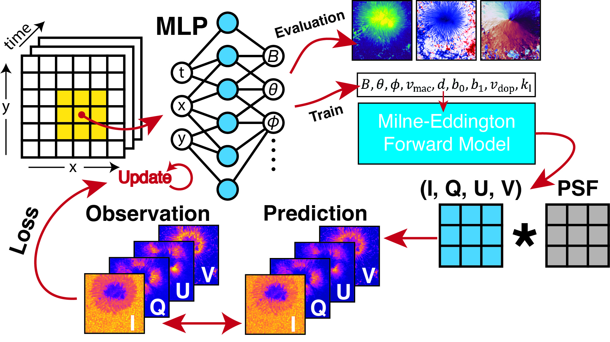

# A Physics-Informed Neural Network Framework for Accurate Milne-Eddington Inversions of Solar Magnetic Fields

## Overview

We present a novel spectropolarimetric inversion method based on Physics Informed Neural Networks (PINNs) to infer the solar photospheric magnetic field under the Milne-Eddington approximation (PINN ME). Our approach maps spatio-temporal coordinates
(t,x,y) to spectropolarimetric parameters, enabling the synthesis of Stokes profiles that are iteratively optimized to fit observations. Instrumental effects are directly incorporated via the point-spread function. Evaluated on synthetic data and radiative MHD simulations, PINN ME demonstrates strong resilience to noise, efficient memory usage, and intrinsic spatio-temporal coupling. When applied to observations, it yields high spatial coherence and resolves small-scale magnetic features in both strong- and weak-field regions.



Overview of the PINN ME Milne-Eddington inversion method. The neural network acts as a representation of the parameter space, and maps pixel coordinates ($t, x, y$) of the input image sequence to the respective plasma parameters. For model training, the parameters are used as input to the fully-differentiable ME forward model which yields the corresponding spectral line profiles of the Stokes vector ($I, Q, U, V$). The  difference (loss) between the predicted Stokes vectors and the observed data is used to update the network weights. The model is iteratively updated until the difference between the modeled and observed stokes vectors converges to a minimum. From the trained model, the individual pixel coordinates can be queried to obtain the final inversion result.

## Installation

PINN ME can be installed via pip. The package is compatible with Python 3.8 and above.
```bash
pip install pinn-me
```
The installation requires pyTorch, lightning, sunPy, and WandB. 
The code is developed for GPU acceleration, and the package will automatically detect the available GPU. If no GPU is available, the code will run on CPU, but it will be significantly slower.

## Usage

### Hinode/SOTSP example

Download the Hinode/SOTSP **Level 1** data from the Hinode archive. The data should be a folder with fits files.
https://csac.hao.ucar.edu/sp_data.php

Example Hinode/SOTSP data available at: https://app.globus.org/file-manager?origin_id=aa4a093a-5b00-4a4b-b8d4-5bb65f324c8c&origin_path=%2F


```yaml
---
base_path: "<<PATH TO OUTPUT DIRECTORY>>"
work_directory: "<<PATH TO DIRECTORY FOR LOGGING>>"
data:
  type: "hinode"
  files: "<<PATH TO FOLDER FITS FILES>>"
  num_workers: 8
  batch_size: 4096
logging:
  project: pinn-me
model:
  encoding: "gaussian_positional"
training:
  epochs: 100
  check_val_every_n_epoch: 5
```

Run the code:
```bash
pinn-me-train --config "<<PATH TO CONFIG FILE>>"
```

### Convert PINN ME output to NPZ

To convert the PINN ME output to NPZ format, use the following command:
```bash
pinn-me-to-npz --input "<<PATH TO .PME FILE>>" --output "<<PATH TO OUTPUT .NPZ FILE>>"
```


## Publication

- Arxiv pre-print: [arXiv:2502.13924](https://arxiv.org/abs/2502.13924)
- Under review for publication in the Astrophysical Journal Letters.

## Citation

If you find this work useful, please cite our paper:

```bibtex
@article{jarolim2025pinnme,
  title={PINN ME: A Physics-Informed Neural Network Framework for Accurate Milne-Eddington Inversions of Solar Magnetic Fields},
  author={Jarolim, Robert and Molnar, Momchil E and Tremblay, Benoit and Centeno, Rebecca and Rempel, Matthias},
  journal={arXiv preprint arXiv:2502.13924},
  year={2025}
}
```
