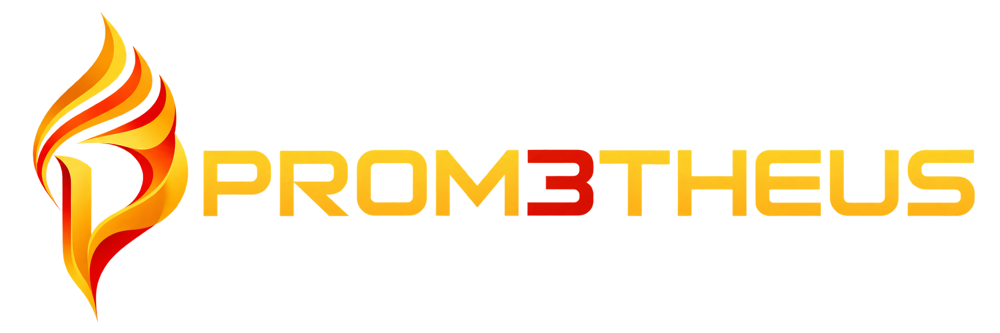

# PROM3THEUS

<p align="center">
  
</p>

**Physics-informed Reconstruction Of Magnetism in 3D THrough EUV and Spectropolarimetry**

PROM3THEUS is a clean LTE spectropolarimetric inversion framework built with
PyTorch and PyTorch Lightning. It fits a continuous, depth-stratified solar
atmosphere directly to Stokes observations and can add magnetofluid constraints
at independent collocation points.

This release supports two complete inversion paths:

- Hinode/SOT Spectro-Polarimeter Fe I 6301/6302 A rasters
- SDO/HMI Fe I 6173 A Stokes rasters with acquisition-specific filter profiles

One joint runner handles single-observation and multi-observation configurations.
HMI/Hinode Stokes and AIA EUV terms share one atmosphere, training lifecycle,
diagnostic service and P3S format. Additional observation/forward providers are
registered explicitly through the component catalog.

The project uses one strict stream schema, canonical observation stores, and
checksum-bound tensor artifacts through one stream runtime.

## Design

```text
configuration + CLI
        |
        v
application runner ---- observations ---- instrument response
        |                       |
        v                       v
inversion objective ---- canonical raster/store
        |
        v
LTE backend ---- explicit ray path ---- polarized formal solver
        |
        v
coordinate atmosphere + optional magnetofluid constraints
```

The numerical LTE backend does not depend on Lightning, FITS readers,
visualization, or the command line. Hinode and HMI are independent adapters that
meet the same canonical observation contract. Model artifacts are a versioned
JSON manifest plus tensor-only weights and checksum-protected NumPy arrays.

The package name and forward-model boundary are not LTE-specific. A future NLTE
backend can own its population/convergence state behind the same observation,
instrument, optimization, and artifact layers.

See the [documentation overview](docs/README.md), [architecture](docs/architecture.md), and the
[complete porting plan](docs/porting-plan.md) for the dependency rules and
removal inventory.

## Installation

Python 3.11 or newer is required.

```bash
python -m pip install -e .
```

Install only the optional stacks needed by your workflow:

```bash
# FITS/SunPy geometry and map readers for Hinode and HMI
python -m pip install -e '.[observations]'

# Diagnostic figures and Weights & Biases logging
python -m pip install -e '.[visualization]'

# HMI Stokes download, Carrington cutouts, and phase-map responses
python -m pip install -e '.[hmi-preparation]'

# AIA download, calibration, Level-1 registration, and store preparation (Python >=3.12)
python -m pip install -e '.[aia-preparation]'

# Everything needed to run the test suite
python -m pip install -e '.[observations,visualization,hmi-preparation,test]'
```

The checksum-pinned LTE atomic, continuum, reference-spectrum, and instrument
metadata for both supported instruments ship in the package. Validate them at
any time:

```bash
prom3theus resources validate
# Hinode atomic tables and complete instrument-specific resource contract
prom3theus resources validate --instrument hinode_sp
```

Runtime inversions never download scientific inputs.

The resource bundle has an explicit ownership layout:

```text
resources/data/
  bundle.json
  sources.json
  common/
    abundances.json
    lines.json
    stic_continuum_table.json
  hinode_sp/
    blend_inventory.json
    instrument_hinode_sp.json
    solar_reference_630nm.json
  hmi_stokes/
    instrument_hmi.json
    solar_reference_617nm.json
resources/sets/euv/aia_euv_v1/
  aia_temperature_response.json
  instrument_aia_euv.json
  manifest.json
  sources.json
```

The complete checksum-pinned, from-scratch generation workflow is retained
separately under [`resource_builder`](resource_builder/README.md).
It is maintenance tooling rather than runtime package code. Running
`./scripts/resources/rebuild.sh` regenerates both instrument namespaces in
`build/reproduced-lte-resources` and requires byte-for-byte agreement with the
committed production bundle.

Manifests and runtime consumers use these complete relative paths. There is no
fallback lookup into the former flat resource directory.

## Run configurations

For a bounded experiment with this checkout's `data/hmi`, see the
[local HMI inversion and force-free baseline](docs/local-hmi-baseline.md).
It combines a small photospheric LTE inversion with a separate spherical
potential extrapolation to 20 Mm and explicit fit/field acceptance checks.
The local example is `configs/hmi_local_constant.yaml`; it assumes a height-independent
photospheric magnetic field and requires a matching
prepared HMI response archive and does not download calibration during training.

The maintained source and distribution contain five public YAML run files:

- [`configs/hinode_lte_mhs.yaml`](configs/hinode_lte_mhs.yaml)
- [`configs/hinode_lte_mhs_extrapolation.yaml`](configs/hinode_lte_mhs_extrapolation.yaml)
- [`configs/hmi_lte_mhs.yaml`](configs/hmi_lte_mhs.yaml)
- [`configs/hmi_lte_dynamic.yaml`](configs/hmi_lte_dynamic.yaml)
- [`configs/hmi_aia_dynamic.yaml`](configs/hmi_aia_dynamic.yaml)

All maintained configurations use strict schema version 3 and the same joint
runner. A single-observation run contains one stream. Schema versions 1 and 2,
legacy Lightning checkpoints, and earlier P3S/archive formats are unsupported.

```text
schema_version
solver
resources
observation
atmosphere
synthesis
instrument
training
loss
diagnostics
runtime
logging
```

Unknown or duplicate keys are errors. The solver and instrument are always
explicit. Relative paths are resolved from the configuration file, so commands
behave the same from every working directory.

The Stokes `objective` supports `type: mse` in stored disk-center
atlas-continuum units. `stokes_weights` multiply the component MSEs directly:
`loss = sum(weight[c] * mean(residual[c]**2))`. They are not normalized, so
multiplying all four by a factor scales the Stokes loss relative to physics.
There is no separate sigma scaling. Older preset coefficients were converted
with `new_weight[c] = old_weight[c] / sum(old_weights) / old_sigma[c]**2`
to preserve their effective losses. Q/U warmup sets only their coefficients
to zero, leaving I/V unchanged.
`type: asinh_mse` keeps I linear and compares Q/U/V after applying
`asinh(value / asinh_scale) / asinh(1 / asinh_scale)` to prediction and target separately. Its default
`asinh_scale` is `1e-3`; direct component weights also apply in this mode.
The HMI+AIA dynamic preset uses linear I and asinh Q/U/V with this scale.
This normalized stretch maps -1, 0 and 1 to themselves and reduces sensitivity
to larger signals. Component weights apply after the normalized transform.
Stokes validation uses the instrument-integrated predictions and observations
passed to the objective and applies the same transform before plotting.
Profiles retain their signs; maps and scatter panels summarize absolute
wavelength integrals of these comparison values. These integrals are diagnostic
summaries; the loss compares individual instrument samples before reduction.

All data and physics losses use squared residuals with their existing masks,
normalization, and component weights. AIA objectives use `type: asinh_mse`.
Remove the former `huber_delta` setting from
custom configurations. Older P3S snapshots remain readable: their objective
metadata and obsolete sigma buffers are migrated in memory to direct weights,
without changing saved atmosphere weights or files.

All maintained YAML files hard-code their GLade input/output paths and Derecho
scratch paths. Ambient environment variables do not redirect these workflows.

Inspect the fully resolved, typed configuration before a run:

```bash
prom3theus validate-config configs/hinode_lte_mhs.yaml
prom3theus validate-config configs/hinode_lte_mhs_extrapolation.yaml
prom3theus validate-config configs/hmi_lte_mhs.yaml
prom3theus validate-config configs/hmi_lte_dynamic.yaml
prom3theus validate-config configs/hmi_aia_dynamic.yaml
```

### Hinode MHS extrapolation

The extrapolation configuration uses one atmospheric PINN over the complete
physical shell. LTE synthesis and opacity-guided ray refinement stop at the
configured line-formation top, while independent collocation batches apply MHS
and `div B` throughout the full shell, microturbulence and hydrostatic-coronal
temperature priors only above the line-formation domain, and transmissive-flow
and tangential magnetic Neumann conditions at the outer boundary. The transmissive velocity
condition drives its normal derivative to zero without selecting inward or
outward flow. The maintained extrapolation configuration reaches 20 Mm while
retaining one PINN for both domains.

### HMI static and dynamic inversions

`hmi_lte_mhs.yaml` fits every selected acquisition with one time-independent
atmosphere constrained by MHS, `div B`, and the top-pressure prior.
`hmi_lte_dynamic.yaml` represents the observed time sequence explicitly over a
single -0.1--50 Mm PINN. HMI line formation remains below 1.5 Mm. The three
Cartesian magnetic network components are a vector potential `A` in G m;
the physical field used by synthesis and physics is `B = curl(A)` in G. Ideal
induction, momentum, continuity, and the exact vector-potential `div B` constraint
act throughout the full shell. The
maintained run disables the adiabatic-pressure and radial magnetic-energy
heuristics and has no potential- or NLFFF-volume loss. A weak prescribed
temperature stabilization acts only in the invisible upper domain. A
transmissive velocity condition, tangential magnetic Neumann condition, and an
external-pressure condition apply at the 50 Mm boundary. Independent random
samples cover the four angular side faces with equal face counts and no shared
height groups. Those faces use zero normal velocity gradient and zero normal
gradient of the tangential magnetic field; no zero-field or zero-normal-flux
condition is imposed.

HMI acquisition selection is explicit in `observation.selection`.
`acquisition_indices: null` uses the complete source sequence; a zero-based
list such as `[10]` loads only those source frames. `validation_raster` uses the
same source-sequence index and must belong to the selected set.

```text
D ln(rho)/Dt + div(v) = 0,
dB/dt - curl(v cross B) = 0,
div(B) = 0.
```

No resistive term is used. Because a complete coronal energy equation is not
yet implemented, the upper-temperature prior is an explicit prescribed
temperature stabilization rather than a conservation equation. The upper
temperature prediction remains trainable, but its log-space target is the fixed
hydrostatic-coronal reference. The top-pressure target is likewise a fixed
external-pressure boundary value; it is not inferred from a magnetic model.
Both targets are detached while the model predictions remain attached.

Volume-physics normalizers are evaluated separately at each sampled height and
detached before division; force-balance normalizers use the evaluated gas
pressure, EOS-derived mass density, and magnetic field rather than the radial
reference profiles. Magnetic boundary residuals use detached point-local
scales. All predicted fields and residual derivatives remain attached. `div B`
uses `B_*/L`, induction uses `B_* (1/T + V0/L)`, and continuity uses the fixed
transport rate. Vector residuals are averaged over components. The top
`upper_boundary_open_velocity` loss penalizes `(r_hat dot grad) v` normalized
by `V0/L`; unlike the previous one-sided no-inflow term, it permits either sign
of radial flow. The analogous side loss uses the outward longitude/latitude-face
normal. Top and side magnetic losses project `(n dot grad) B` into the local
boundary tangent and normalize it by point-local
`sqrt(B^2 + B_floor^2) / L`.

Gradient-only velocity boundaries leave a spatially uniform flow unconstrained.
The dynamic HMI and HMI+AIA examples also enable `side_boundary_no_inflow`
(weight `0.1`), penalizing `max(-v dot n, 0) / V0` on the four angular sides.
A horizontal through-flow then incurs a loss on its entry side. This is a soft
outflow-only prior on the sides at all sampled heights; it does not impose zero
velocity in the volume or restrict the sign of radial flow at the top. Increase
its weight if boundary inflow remains excessive. Existing trained save states
are unchanged; the condition takes effect when training with the updated config.

The volume `magnetic_current_free` penalty uses the mean square of the
height-normalized curl, so concentrating the same magnetic-field rotation into
a thinner current layer costs more. All volume, boundary, Stokes, and AIA residuals use mean-squared
penalties. In the dynamic HMI examples, `magnetic_current_free_steps: 5000`
sets the duration of the initial full-weight penalty, and
`magnetic_current_free_final_factor: 0.1` retains ten percent of that weight
afterward. The default final factor is zero for configurations that omit it.
This is a soft bias toward smaller currents throughout the volume, including
physical currents; it is not a substitute for force balance or evidence that a
particular current sheet is artificial.

The atmosphere is a continuous spherical shell, configured entirely by physical
height bounds. It has no `depth_grid` or model-level sample count. Each Stokes
stream owns `data_term.depth_sampling`: `sample_count`, coarse-to-fine
refinement, and `reference_log_tau500_bounds` (default `[-5, 1]`). These FALC
reference coordinates shape the sampling distribution before conversion to metres;
they are not the learned atmosphere's optical depth. AIA independently samples
geometric heights with its power-two distribution. Exported physical depths are
`geometric_height_m`; `stokes_reference_log_tau500` labels only the Stokes sampling
proposal. Optical depth is derived from predicted opacity.

The top gas pressure is not a YAML tuning parameter. The bundled reference keeps
the existing 25-point STiC FALC_82 line-formation mapping on
`-5 <= log10(tau500) <= 1` unchanged, then restores all 37 native FALC samples
with `log10(tau500) < -5` for the physical-height thermodynamic reference. The
true native top is 2.073502459 Mm, where `T = 100 kK` and
`p = 0.0319344213 Pa`. Above that point, a quintic smootherstep in `log(T)`
reaches the configured 1 MK corona at 2.5 Mm and remains isothermal. Pressure is
integrated hydrostatically to the configured outer height using inverse-square
gravity and the same combined plasma closure used by synthesis.

`SolarPlasmaTable` is the single runtime provider for radiative and
thermodynamic plasma quantities. It reproduces the packaged STiC values exactly
from 2512 K through 10 kK. Between 10 kK and 31.6 kK, a quintic C1 window fades
the neutral-H and Fe I reservoirs and true continuum absorption to zero, while
continuum scattering transitions to analytic Thomson extinction, `n_e sigma_T`.
The thermodynamic branch joins the STiC state to a compact CHIANTI 11.0.2
default-coronal-equilibrium electron mapping, remains exact through 10 MK,
blends to the fully ionized ideal STiC mixture over 10--20 MK, and is exactly
ideal at and above 20 MK. Density, electron density, and mean particle mass use
one composition closure throughout.

Temperature, gas pressure, and microturbulence are decoded as unbounded linear
residuals around their references in natural-log space. The provider evaluates
those actual positive model values; it does not clip the model state or add a
table-support loss. Outside the STiC pressure axis, radiative reservoirs are
continued using the hybrid-EoS density ratio: one power for populations and
scattering and two powers for true absorption. This gives the expected linear
and quadratic pressure tails while keeping gradients back to the unrestricted
model outputs. Below the cold STiC edge, composition is frozen but the actual
ideal-gas `P/T` density scaling is retained.

## Preparing HMI responses

The Hinode run consumes calibrated `sp_prep` Level-1 FITS products with an
increasing wavelength WCS. The loader validates their wavelength, calibration,
geometry, and provenance contracts while constructing canonical rasters.

HMI runtime input is also entirely local. Build the phase-map response archive
for the exact HMI FITS acquisitions before inversion (a registered JSOC email is
required for this preparation step):

```bash
export JSOC_EMAIL=you@example.org
prom3theus prepare hmi-responses /path/to/hmi/*.fits \
  --output /path/to/calibration/hmi/2024-03-23
```

No phase-map identifier is supplied by the user. For every input `T_REC`,
preparation queries the matching definitive `hmi.B_720s` record for its
authoritative `INVPHMAP` assignment, then resolves and downloads that exact
camera record from `hmi.phasemaps_extended`. The manifest records the assignment
record, phase-map FSN, calibration record, and archive checksum for every
acquisition.

The HMI YAML points `observation.calibration.transmission_profile_directory` to
that directory. The preparation manifest binds every response archive by
SHA-256; the inversion verifies and selects each acquisition's response without
network access.

Polarization conventions are owned by the instrument operator at the boundary
between physical fields and spectral synthesis. HMI explicitly adds 90 degrees
to the observer-frame magnetic azimuth before LTE synthesis; this is equivalent
to mapping `[Bx, By, Blos]` to `[-By, Bx, Blos]`. Hinode uses the identity
mapping. The correction never rotates the Cartesian atmosphere used by physics,
saved cubes, or vector-field exports, and both the resolved configuration and
instrument metadata record the applied convention.

## Download, preparation, and run scripts

The repository keeps the workflows as small, instrument-specific shell files.
They use fixed paths inside the checkout and contain no dispatch logic or
overwrite modes. Both inversion launchers retain PBS headers and can be
submitted directly with `qsub`.

For the HMI run, download the exact native-cadence `hmi.S_720s` sequence,
prepare the 1024 by 512 Carrington cutouts used by the configuration, build the
phase-map response archive, and start the inversion:

```bash
export JSOC_EMAIL=you@example.org
./scripts/hmi/download.sh
./scripts/hmi/prepare.sh
./scripts/hmi/run.sh
```

The defaults reproduce the retained 2024-03-23/24 HMI workflow using 20 native
12-minute slots in the half-open interval 22:12--02:12 TAI (last slot 02:00),
Carrington longitude 215 degrees, latitude -12 degrees, and a 1024 by 512 pixel
cutout. Response preparation resolves the calibration assigned to each
acquisition directly from JSOC. Delete or move an existing prepared directory
before intentionally rebuilding it; the scripts never overwrite data.

The 1024 by 512 cutout is exact: preparation does not append, reflect, or fill
extra pixels, and the inversion has no separate science-FOV mask or numerical
padding width. Physics longitude/latitude bounds are the extrema of valid
observed surface pixels across the selected timeline. Consequently, any guard
region is contextual margin chosen when making the large cutout; side boundary
samples lie on that cutout's valid angular envelope.

The joint HMI+AIA workflow has three deliberately small server commands:

```bash
python -m pip install -e '.[aia-preparation,observations,visualization]'
export JSOC_EMAIL=you@example.org
./scripts/sdo/download.sh
./scripts/sdo/prepare.sh
./scripts/sdo/run.sh
```

All data live below the fixed base
`/glade/work/rjarolim/data/prom3theus/2024_03`: full-disk and subframed HMI files under
`hmi/`, and Level-1, calibration, and prepared AIA products under `aia/`.
`download.sh` calls two independent packaged downloaders:
`prom3theus download hmi-stokes` for full-disk Stokes sequences, and
`prom3theus download aia-euv` for EUV observation files only.
Image acquisition uses DRMS directly and assumes it is installed;
there is no alternate image-download backend or dependency probing. The pinned
AIA degradation table remains a separate SSW calibration resource.
HMI uses a TAI record interval. AIA uses its own UTC
start/end, cadence, and channels; it never reads HMI
files. Download dates are parsed with `dateutil`: date-only, space-separated,
ISO, and month-name forms are accepted without adding `Z` in shell scripts.
Unzoned dates mean TAI for HMI and UTC for AIA (including calibration); explicit
timezone offsets are converted to the respective scale. HMI requests use the
native 12-minute cadence. End times are exclusive.
The HMI downloader (`prom3theus.download.hmi`) delegates directly to DRMS,
including filename and existing-file handling; there is no custom skip or
overwrite option. It creates no staging or backup directories. FITS validation
belongs to preprocessing.
The AIA downloader (`prom3theus.download.aia`) also delegates directly to DRMS,
with one export per channel. There is no nearest-record search, download
manifest, calibration, or custom existing-file handling in either downloader.

The AIA downloader supports 94/131/171/193/211/304/335; current preparation and
the run remain configured for 171/193/211. Calibration acquisition belongs to
preprocessing, not the observation download.

`prepare.sh` calls `prom3theus prepare hmi` to check and crop Stokes files,
`prepare hmi-responses` to build missing filter-response resources separately,
and `prom3theus prepare aia` to calibrate and crop EUV images. The image workflows live in
`prom3theus.preprocess.hmi` and `prom3theus.preprocess.aia`; no Python workflow
code remains under `scripts/`. Input/output and response/calibration directories
are explicit arguments, so the APIs do not assume the server directory layout.
The shell commands are unconditional. The Python response command validates and
reuses existing resources; `--overwrite` explicitly rebuilds them.
The joint YAML's optional `scene.time_window: {start: "...", end: "..."}` limits
both observation streams for the run without changing downloads or preprocessing.
Dates without offsets mean UTC; the start is inclusive and the end exclusive.
HMI uses actual `T_OBS` converted from TAI, and AIA retains complete exposure groups
only when every channel lies in the interval. Validation falls back to the first
retained acquisition/group if its configured frame is outside the window.
Prepared AIA calibration and normalization statistics remain unchanged.
`prepare aia` scans the downloaded FITS files, derives their metadata and pointing interval, and
acquires or reuses correction/pointing tables in `--calibration-directory`.
The file scan accepts only valid, positive-exposure images with `QUALITY=0`.
Unreadable headers, missing metadata, and unsupported channels
are skipped with warnings. Incomplete or duplicate-channel 171/193/211 groups are
also skipped; preparation stops if no complete valid group remains. Source files
are never deleted by these checks.
The initial AIA scan reads headers only: no image decoding or full-file hashing.
Each bounded worker then hashes, reads, validates image pixels, calibrates, crops,
and writes one image's arrays directly to the final directory before releasing its arrays.
Only lightweight file metadata is returned to the coordinator. The exact global
normalization medians use disk-backed scratch files in that directory. The manifest
is written last, after all images and statistics complete. Failed runs retain
completed files but have no completed-store manifest. Neither AIA images nor
calibration tables use directory staging. Existing-store reuse verifies input checksums separately.
Both preparation workflows show completion progress bars. Independent file
checks, HMI SunPy submap/writes, AIA image calibration/crops, and unique HMI
response-profile computations run in shared-memory threads. Set
`PROM3THEUS_PREP_WORKERS` in `prepare.sh` or the environment (default 16; use 1
for serial debugging). Full-disk AIA processing needs substantial RAM per worker.
AIA pointing/correction tables are loaded once before workers start and shared;
HMI profiles are built once per unique phase-map/camera identity and reused across
acquisitions. Shared DRMS client access and final output publication remain serial.
Calibration uses aiapy's standard table getters, caches the resulting ECSV files,
and checks V10 availability and continuous pointing coverage. There is no artificial
24-hour limit or exact runtime-version gate. Standalone table acquisition is
available as `prom3theus prepare aia-calibration`.
The AIA output stores calibrated intensities, valid-pixel masks, and
SunPy-derived line-of-sight geometry. No uncertainty images are computed.
HMI outputs remain native-pixel FITS crops with updated WCS and detector offsets.
SunPy performs the coordinate transforms, submap extraction, and WCS updates;
there is no separate HMI crop-planning pass. Pixel-sized HMI and AIA cutouts use
the same centered SunPy submap helper. HMI FITS scaling is decoded by Astropy;
saved crops retain the physical values rather than the original integer encoding.
HMI workers write directly to the requested output directory using the source
filenames; there are no crop staging or backup directories. Completed files remain
in place if processing fails.

To choose a subframe visually, run on a desktop with an interactive Matplotlib
backend (or an SSH session with graphical forwarding):

```bash
PYTHONPATH=src python -m prom3theus.preprocess.select_subframe \
  data/aia.lev1_euv_12s.2011-02-14T000009Z.193.image_lev1.fits
```

Drag a rectangle, adjust its handles, and press Enter. Paste the printed
variables into `scripts/sdo/prepare.sh`; Escape cancels. The tool uses the FITS
observation time/WCS to return a Carrington center and equivalent nominal HMI
`width_pixels` / `height_pixels` (0.5 arcsec/pixel). No HMI reference file is
needed. Off-disk selections are rejected. The asinh display stretch
makes faint EUV structures easier to see without modifying the image data.
Both use the same Carrington center and dimensions in HMI detector pixels,
configured once in `prepare.sh` (currently 256 × 128). Each instrument crops
independently around that center at its own observation time. AIA converts the
dimensions using 0.5 arcsec divided by its registered pixel scale (normally
0.6 arcsec/pixel), rounding to nearest pixels: 256 × 128 becomes 213 × 107.
The overlap is approximate; timing, orientation, and pixel rounding can differ.
There is no reference-file matching, reprojection, or HMI footprint mask.
Off-disk and invalid AIA pixels remain excluded from fitting.
Reuse checks reject changed crop settings. `run.sh` starts the
inversion from `configs/hmi_aia_dynamic.yaml`. HMI and physics optimize while
AIA renders at weight zero. Setting `coronal_euv.data_term.weight` positive
(for example, `0.1`) activates its likelihood and calibration priors; no run-mode
change is needed. The script only launches training when you execute it.

The HMI preprocessor scans every complete 24-segment acquisition in
`hmi.S_720s` for `CAMERA=1`, `2`, or `3`, requiring `QUALITY=0` when the keyword
is present. Historical HMI exports without `QUALITY` are accepted without adding
a fabricated quality keyword; AIA quality requirements are unchanged.
Response calibration remains keyed by the FITS `HCAMID`, not by the filename's
`CAMERA` code. It reads acquisitions from
`hmi/full_disk` and creates the complete time series of 256 by 128 Carrington
subframes; it is not restricted to the one-slot initial download. The inversion
uses all prepared HMI acquisitions. The download script still requests one slot;
extend both instrument intervals before preparing data to constrain temporal
evolution from a time series.

The minimal AIA preparation is: scan and validate the downloaded FITS files,
update pointing, register Level 1 to Level 1.5, apply the V10
degradation correction once, exposure-normalize to DN/s, retain the configured
Carrington footprint, construct rays/masks, and write the immutable
image store. Record identities and
checksums are derived during preprocessing, and calibration provenance remains
in its calibration manifest. No download or joint-request manifest is required.

Run download and preparation with Python 3.12 on a host with JSOC/SSW network
access, then run the dry check where the configured `device: auto` GPU is
visible. Existing immutable instrument outputs are validated and reused.

AIA calibration download and preparation require Python 3.12 and the
`aia-preparation` extra. Training consumption of the resulting
store retain the package's Python 3.11 floor. Preparation updates pointing,
registers Level 1 to the native
0.6-arcsec Level-1.5 grid, exposure-normalizes the image, applies V10
degradation correction exactly once, and preserves finite negative values. It
never reprojects AIA pixels onto the HMI raster.

The AIA loss is channel-balanced MSE on the difference of
`f(x) = asinh(x / a) / asinh(1 / a)`, using the same implementation as Stokes
and all AIA comparison/side-view plots. Intensities are divided by the fixed
channel maximum; `a` is the channel's median absolute valid observed intensity
divided by that same maximum. Thus normalized intensity 1 maps to 1. There is no uncertainty weighting
or model-discrepancy floor. Calibration gains remain separate. Existing prepared
stores can be reused: their uncertainty arrays are ignored and legacy scales are
recomputed from the observed intensities without rewriting the store.

The committed joint configuration uses deployment-specific GLade paths. Point
its HMI directory, HMI transmission-profile directory, and AIA directory at
other prepared locations before running it elsewhere.

Hinode acquisition and SolarSoft `sp_prep` calibration remain external because
there is no equivalent trustworthy Python preparation in this package. Place
the calibrated Level-1 columns directly in
the configured directory
`/glade/work/rjarolim/data/inversion/hinode_2011_02/20110214_000004`. Validate
the packaged atomic, continuum, blend, solar-reference, and spectral-response
resources, then run the static MHS inversion:

```bash
./scripts/hinode/load_resources.sh
./scripts/hinode/run.sh
```

The scripts contain no cluster scheduler, machine-specific path, account,
email, or removed namespace assumptions.

## Running an inversion

```bash
prom3theus invert configs/hinode_lte_mhs.yaml
prom3theus invert configs/hinode_lte_mhs_extrapolation.yaml
prom3theus invert configs/hmi_lte_mhs.yaml
prom3theus invert configs/hmi_lte_dynamic.yaml
```

Start joint optimization:

```bash
prom3theus invert configs/hmi_aia_dynamic.yaml
```

The initial training path uses one CPU/CUDA device, Adam, a configured learning-rate
schedule, every configured stream, and shared physics/regularization objectives.
It logs online to W&B and preserves the LTE Stokes, thermodynamic, magnetic-field,
velocity, current-density, optical-depth, and meridional-slice figures. AIA adds
one native-pixel comparison figure: observations above gain-adjusted synthesis,
one column per channel, without interpolation. AIA uses the same regular-grid
subsampling helper and `diagnostics.visualization.ray_sampling.max_pixels` budget
as LTE (4096 pixels per channel in the maintained run). Both rows display that
same compact native-pixel grid; full-resolution image synthesis is not required
for validation. It uses SunPy's wavelength-specific
AIA colormaps and the objective's fixed channel scales for `asinh(I/a)/asinh(1/a)`, with
one observation-derived colour range shared by both rows. No per-image rescaling
or second stretch is applied. Contributions are optional and
disabled in the maintained run. Joint figures are saved under
`solver.work_directory/validation/step_XXXXXXXX/diagnostics`.

AIA datasets divide intensity by a fixed per-channel maximum absolute valid
count rate, measured across the selected time window at loading. Targets are
therefore dimensionless and within `[-1, 1]`; valid negative values are retained.
Training divides physical synthesis by exactly the same channel maximum before
the calibration gain and loss. The asinh scale is divided by that maximum too;
both objective and plots apply the normalized stretch in these dimensionless units.
Predictions are not clipped. The
maxima are recorded in run metadata/checkpoints; prepared stores remain in
physical DN/s/pixel and do not need rebuilding. Older checkpoints migrate the
non-trainable scale buffers when resuming.

The dashboard keeps the original `train.*` / `valid.*` LTE metrics. AIA adds
`train.aia_loss`, `valid.aia_loss`, and per-channel validation losses and gains
(`valid.aia_171_loss`, `valid.aia_171_gain`, etc.). AIA losses are the unweighted
asinh-space MSE mismatch; the YAML stream weight controls their contribution
to the total loss. Detailed internal reports are not flattened into W&B metrics.
Previously logged W&B history is not deleted by this cleanup.

The maintained joint run fits HMI Stokes and AIA EUV data with weights 1.0 and
0.1. Both use the shared atmosphere. AIA uses 96 coarse plus 96 emission-guided
fine points per ray. Training perturbs interior coarse points and uses stratified
random fine quantiles; validation/export uses fixed points and quantiles. The
final merged grid supplies physical line elements in metres, including half-interval
endpoint weights; refinement never adds the coarse and fine integrals separately.
Coarse and fine evaluations share gradients and the fine pass evaluates only new
points. Shared inverse-CDF and sample-merging machinery also serves LTE's
opacity-guided refinement.

`training.reference_stream` selects the stream defining an epoch (the scene
reference is used if omitted). Other loaders keep their own cursors across
epochs. Checkpoints record cursor/RNG state; restoring replays delivered batches
of the current pass, so restart cost grows with progress through that pass.

Startup reuses the completed HMI, Hinode, and AIA datamodule setup from
`solver.work_directory/observation-cache/<stream>/startup` when its inputs are
unchanged. The snapshot restores datasets, valid-pixel indexes, sampling bounds,
and AIA scales; raw observation tensors remain copy-on-write memory maps of the
canonical store. Loss-weight and model-setting changes do not invalidate it.

The first load performs the full source/checksum/geometry validation. Subsequent
loads check file paths, sizes, nanosecond modification/change times and file
identities instead of rehashing every byte. Source additions/removals, changed
store or calibration files, observation/loader selections, time windows, resources,
and code/dependency changes invalidate setup. `--rebuild-observations` bypasses
reuse. A missing or damaged snapshot falls back to normal loading. This disposable
Python-object cache is local to the work directory, not a portable data format.
Public observation stores and `.p3s` snapshots keep their existing formats.

Validation plots and metrics are written under
`solver.work_directory/validation/step_XXXXXXXX`. The output directory contains
the two rolling durable files directly:

```text
state.p3s   # atomic evaluation snapshot: atmosphere, all streams, resources, progress
last.ckpt   # optimizer, scheduler, sampling cursors/RNG, and model state
```

There are no numbered checkpoints or checkpoint subfolders. `last.ckpt` is
resumed automatically; `training.resume_from_checkpoint` selects another current
checkpoint explicitly. Changed observation/model contracts are rejected.

`prom3theus.artifacts.P3SLoader` reconstructs the atmosphere and every configured
forward term without a Trainer, raw FITS data, or observation-cache rebuilding.
`loader.predict(stream_id, canonical_batch)` predicts a stream directly. Raster
queries and the export CLI open the snapshot's prepared observation store lazily.
Use `--stream ID` to select the Stokes stream for raster-based exports; it defaults
to the scene reference. `loader.fields_at_coordinates(...)` evaluates physical
fields without loading observation arrays. Old archive APIs were removed.

```bash
prom3theus export /path/to/run/state.p3s /path/to/atmosphere.npz \
  --depth-samples 101 \
  --batch-size 4096 \
  --include-stokes
```

Export opens `state.p3s` with `P3SLoader`, verifies its parameters, resources,
and signature-addressed observation cache, and evaluates the requested depth
grid. The prepared cache under the configured `solver.work_directory` must
remain available; no separate artifact directory or original FITS files are
needed. NPZ metadata includes the P3S checksum, epoch, step, resolved
configuration, and observation identity. For a
multi-raster sequence, the spatial export is evaluated on the validation raster
named by the immutable observation-store manifest.

The default atmosphere arrays follow those observer rays only through the LTE
line-formation domain. To export the upper solution from an extrapolation run,
request the separate full-shell product explicitly:

```bash
prom3theus export /path/to/run/state.p3s /path/to/atmosphere.npz \
  --include-full-shell \
  --full-shell-samples 161
```

The additional `full_shell_*` arrays sample outer-to-inner geometric height on
radial Carrington columns rooted at every valid validation-raster chart/time
coordinate. Their Cartesian vectors use the heliocentric Carrington frame and
their velocities are co-rotating. They include position, temperature, gas
pressure, mass density, microturbulence, magnetic field, and velocity in
Cartesian and local spherical components. This product does not assign optical
depth or synthesize Stokes profiles above the line-formation domain; its NPZ
metadata records the physical height bounds, sampling convention, and vector
frames. Cost scales with valid pixels times `--full-shell-samples`; lower
`--batch-size` when device memory is limited.

### Comparing a trained HMI result with `hmi.B_720s`

This standalone diagnostic opens `state.p3s` through `P3SLoader`, selects the
stored Stokes raster matching the reference `T_OBS`, samples the full-disk HMI
vector record onto its exact detector pixels, and writes spherical-component
and azimuth figures, reusable comparison arrays, and JSON metrics. It does not
participate in training.

Download the four comparison segments (`field`, `inclination`, `azimuth`, and
`disambig`) for one native HMI vector record before running the diagnostic.
Unzoned timestamps use TAI; timestamps with a UTC offset are converted to TAI.
The downloader accepts `--email` or the `JSOC_EMAIL` environment variable.

```bash
prom3theus download hmi-comparison \
  --time 2011-02-14T01:00:00 \
  --output data/hmi_comparison_20110214/reference
prom3theus compare-hmi data/state.p3s \
  data/hmi_comparison_20110214/reference \
  --output data/hmi_comparison_20110214/results
```

```bash
prom3theus compare-hmi /path/to/run/state.p3s \
  /glade/work/rjarolim/data/hmi_stokes/test_2024_03_24 \
  --output /path/to/run/hmi_comparison \
  --height-km 0 \
  --disambig-bit 0 \
  --minimum-transverse-gauss 200 \
  --device cuda
```

Bit 0 is the minimum-energy/smoothed-minimum-energy result in strong and
intermediate pixels and the potential-field result in weak full-disk pixels.
Since the compact comparison input does not contain `conf_disambig`, headline
branch and component metrics are restricted by the explicit transverse-field
threshold. Use `--disambig-bit 2` to inspect the radial acute-angle alternative.
The component convention is HMI/SHARP CEA: radial outward, theta southward, and
phi westward.

The comparison also tests all eight global azimuth conventions
`chi' = sign * chi + k * 90 degrees`, with both azimuth directions and four
quarter-turn rotations. It ranks them by the mean `Btheta`/`Bphi` Pearson
correlation on strong-transverse pixels and records the component correlations
for both the strong and all-valid masks. The HMI disambiguation bit is applied
after each coordinate-convention transform.

## P3S query API

All common P3S reconstruction, raster selection, and model queries are owned by
one loader:

```python
from prom3theus.artifacts import P3SLoader

loader = P3SLoader("/path/to/run/state.p3s", device="cuda")
cube = loader.cube(depth_samples=101)
full_cube = loader.full_cube(height_samples=161)
layers = loader.shell_slices([0.0, 1.0e6, 10.0e6])
meridional = loader.meridional_slice(215.0)
stokes = loader.stokes()
surface = loader.raster_fields_at_height(0.0)
```

Raster lookup by validation role, index, name, or nearest observation time is
also handled by `P3SLoader`; callers do not open observation stores directly.

## Numerical API

The public package root deliberately exposes only its version. Import from the
layer that owns an operation:

```python
from prom3theus.config import load_config
from prom3theus.resources import validate_resource_bundle
from prom3theus.rt import LTESynthesizer, RayDistancePath

config = load_config("configs/hinode_lte_mhs.yaml")
resources = validate_resource_bundle()
```

Standalone LTE synthesis always receives an explicit integration path. The
formal solver never guesses whether an array represents optical depth,
geometric height, or ray distance.

## Synthetic recovery and tests

Run the differentiable synthetic recovery check:

```bash
prom3theus recovery --check --steps 500
```

Run the focused suite from the source tree:

```bash
pytest
```

The suite covers the strict maintained configurations, coordinates and neural
primitives, LTE opacity and polarized transfer, ray geometry, both instruments,
safe observation/artifact persistence, inversion constraints, training
orchestration, CLI behavior, package boundaries, and wheel contents.
