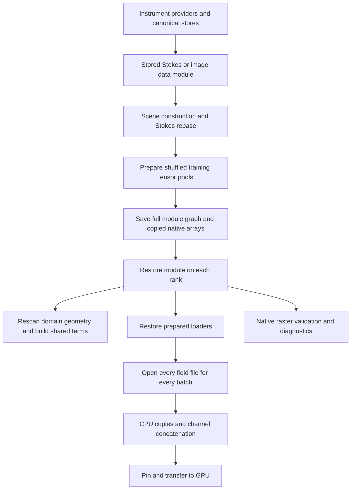

# Data modules and datasets: audit and refactoring plan

Status: proposed implementation, based on the working tree inspected on 2026-09-11.
This audit adds documentation and a reproducible probe; it does not change the runtime.

The recommended design is **one saved data module containing small dataset descriptors,
one explicit disk reader per process, and one deterministic batch schedule**.
Keep bulk numerical payloads on disk and generate random physics points on the target
device from bounds. Separate preparation from loading so that restoring a module never
repeats source preparation or derives the same geometry again.

The recent persistence change is a useful transition, but should not be the final
architecture: it serializes the existing object graph and substitutes a tensor subclass
for payloads. That preserves too much runtime state, creates another copy of native
arrays, and makes the cost and semantics of disk access difficult to control.

## 1. Scope and verification

Reviewed all 21 modules in `observations` (5,152 lines, including scientific contracts),
the HMI/Hinode/AIA ingestion and setup entry points, joint assembly and training,
validation selection, stream scheduling, transfer ownership, and physics sampling.
The file count is an inventory, not a line-count reduction target.

Executed 228 related tests: **223 passed, four failed, one skipped**. The skipped check
requires CUDA. Tests covered observation stores, dataset contracts, loading and shuffle,
scene rebasing, application integration, training/resume, custom providers, instrument
loading, shell sampling, and architecture boundaries. This was not the entire project
suite or a production-data training run.

| Failing test | Finding | Disposition |
| --- | --- | --- |
| `test_joint_loader_reuses_cache_and_explicit_rebuild_bypasses_it` | Still expects the removed per-stream startup cache | Replace with module-level lifecycle coverage; do not reinstate two caches |
| `test_third_observation_type_registers_without_runner_changes` | Saving the full graph cannot pickle the local `PointData` provider | Actual extension regression from the recent persistence change; serialize stable descriptors instead |
| `test_checkpoint_contract_ignores_worker_policy_but_retains_batch_size` | Test requires batch size in the scientific contract, implementation strips it | Resolve the existing contract/test disagreement alongside schedule migration; the previous change did not edit this function |
| `test_default_stokes_builder_converts_yaml_component_keys` | `qu_warmup_steps` reaches a constructor that does not accept it in this test | Separate existing objective/test issue, outside data loading |

Evidence and reproduction:

- [Test results](assets/data-loading-audit/test-results.json): per-test status and failures.
- [Probe](assets/data-loading-audit/probe.py) and [measured results](assets/data-loading-audit/probe-results.json).
- [Performance measurements](data-loading-audit-measurements.md): timings and their limits.

Tests and probes ran on macOS arm64, Python 3.11.15, PyTorch 2.12.0, NumPy 2.4.6.
The probe uses one PyTorch CPU thread, synthetic local files, and a warm OS cache.
No conclusion about CUDA utilization, cold shared-filesystem throughput, or multi-node
scaling is supported by these measurements.

## 2. Current data flow and ownership



| Area | Current files and responsibility | Recommended disposition |
| --- | --- | --- |
| Scientific schemas | `contracts.py`, `image_contracts.py`, `scene.py` | Keep scientific differences explicit; represent persisted metadata independently of live tensors |
| Canonical storage | `store.py`, `image_store.py` | Keep both public formats; share low-level array and publication helpers |
| Source preparation | `registry.py`, instrument data modules, `components/observations.py` | One coordinator; source adapters produce descriptors or bounded blocks |
| Native indexing | `dataset.py`, `image_dataset.py`, `catalog.py` | Share catalog/index mechanics; keep two small payload adapters |
| Dataset storage | `tensor_dataset.py` | Retain packed disk layout; remove runtime read ownership from the descriptor |
| Execution | `bulk.py`, `tensor_loader.py`, `loading.py` | Separate explicit reads, sample scheduling, and prefetch; eliminate inheritance from a native-only loader after its source is discarded |
| Module lifecycle | `data.py`, `image_data.py`, `persistence.py` | One persistent module with per-stream descriptors; per-process runtime binding creates readers/loaders |
| Legacy cache | `startup_cache.py`, provider `cache_sources` helpers | Remove obsolete cache; move the remaining identity helper to preparation/versioning |
| Training coordination | `training/streams.py`, `training/transfer.py` | Keep committed-cursor semantics and CUDA ownership; add rank-aware scheduling |

A serialized `JointDataModule` currently contains `LoadedJointStream` objects, nested
`PreparedObservationStream` objects, per-stream Lightning data modules, raster objects,
datasets, specs, and prepared loaders. Several references alias the same objects, so
these are not all independent memory copies. However, their ownership and lifecycle are
spread across layers, and the module persists operational settings with data identity.

## 3. Findings ranked by impact

### P1 — Remove implicit disk operations from `DiskTensor`

Source: `observations/persistence.py:DiskTensor` and `bulk.py:BulkReader._block`.

Each tensor operation materializes a new file mapping. The probe measured 100 mapping
calls for 100 slice copies. Even cached native slabs incur mapping calls because
`_block()` slices every field to compute row sizes before testing the cache. The
measurement artifact records the exact cache-hit count.

There is also a semantic hazard: `x.add_(10)` on a restored reference does not affect a
subsequent read of `x`. This is reproduced, but is not proof that the present training
path performs such an update. Operations can also produce ordinary tensor views that
retain mappings, so retaining only paths in the original object does not bound the
lifetime of all returned storage.

**Action:** replace the subclass with an `ArrayRef` value and explicit read operations.
Dataset descriptors retain filenames and schema only. A process-local `ReadSession`
owns bounded mappings and always returns owned batch tensors. Tiny bounds, scene basis,
wavelength metadata, and scalar constants should not each become separate array files.

### P1 — Avoid repeated file open/header/map/close work during training

Source: `tensor_dataset.py:TensorDiskDataset.read`.

Every batch opens each field through `np.load(..., mmap_mode="r")`, reparses its header,
copies the slice, and closes the mapping. For F fields and K batches this is F×K mapping
cycles per pool pass. The measured six-field fixture makes six `np.load` calls per
batch. The comparison prototype reuses six mappings while making the same owned copies;
it is substantially faster in the warm-cache CPU microbenchmark.

**Action:** parse headers once and reuse a bounded number of mappings in `ReadSession`.
This does not put tensors in datasets or preload the corpus. Bound open mappings and
application-owned buffers separately from the OS page cache. With many files, an LRU
may evict and reopen them; the claim is one open per resident file, not unlimited caching.

### P1 — Rank-aware restore is not distributed training

Sources: `persistence.py:restore_or_create_data_module`,
`tensor_loader.py:_generator/_batches`, `training/streams.py`,
`application/joint_training.py:run_joint_inversion`.

The trainer explicitly selects one device. Batch schedules have no rank or world-size
input, and two restored loaders return identical first batches. Simply launching more
GPU processes therefore does not implement disjoint distributed data sampling.

Without an initialized process group, a worker asked to rebuild can immediately load
an old existing archive while rank zero prepares its replacement. Rank-zero exceptions
are not published: filesystem workers wait until timeout, while collective workers can
remain blocked until the process-group timeout. The fallback from global rank to
`LOCAL_RANK` is ambiguous on multiple nodes.

**Action:** distinguish independent jobs sharing immutable data from ranks in one DDP
job. Introduce an explicit runtime rank context and one coordinator-owned publication
protocol. For DDP, initialize coordination before preparation, broadcast success/error
and generation identity, then load exactly that generation. Do not serialize rank,
CUDA device, process groups, threads, or queues.

PyTorch DDP does not partition inputs for the application; input sharding is the
application's responsibility. [PyTorch 2.12 DDP documentation](https://docs.pytorch.org/docs/2.12/generated/torch.nn.parallel.DistributedDataParallel.html).

### P1 — The restored module is not the complete prepared data state

Sources: `application/joint_assembly.py:build_joint_runtime/_default_shared_terms_builder`,
`application/joint_streams.py`.

The saved module omits final joint observation bounds, Stokes-only potential-source
bounds, observation-time summaries, and final validation selections/batches. Shared
assembly rescans geometry after every restore, on every rank. The joint bounds routine
makes two surface/time passes and an additional image ray-span pass; potential boundaries
can request more Stokes passes and time collection.

**Action:** compute data-derived geometry summaries once after scene rebasing and save
them in the module. Model/physics terms should consume summaries and small domain specs,
not request raw raster scans. A circular-longitude bound may legitimately need a second
pass; retain exact behavior, but do those passes once per prepared generation.

### P1 — Initial preparation still has corpus-sized memory paths

Sources: `instruments/hmi/timeline.py:HMIDataModule.setup`,
`observations/io.py:ordered_parallel_map`,
`instruments/aia_euv/observation.py:robust_asinh_scales/load_prepared_aia_observation`,
`scene.py:rebase_stokes_raster`.

HMI setup collects all acquisition results before writing a sequence. Limiting thread
count does not limit retained completed results. AIA loading verifies/materializes the
full sequence and recalculates a concatenated float64 median before applying the time
window. It also replaces rasters to discard uncertainty after reading it. Stokes
rebasing clones the full coordinate raster and gathers all valid positions at once.

**Action:** stream completed acquisitions to canonical storage; select manifest entries
before opening payloads; retain verified precomputed full-store AIA statistics; derive
selected-window maxima from exact per-raster summaries; rebase coordinates in bounded
blocks into one derived array. Do not replace exact medians with medians of medians or
an approximate quantile without an explicit scientific-contract change.

### P1 — Serialization duplicates data and freezes the wrong state

Sources: `persistence.py:_DiskPickler/JointDataModule`,
`application/joint_training.py:prepare_training_loaders`.

The pickler writes every ordinary tensor to a new NPY even when it already maps a
canonical NPY. The probe shows a native 65,664-byte file copied to another equally sized
file. Views can also be serialized separately. Native stores, copied snapshot rasters,
and shuffled pools can coexist. Old successful `data-arrays-*` generations are not
removed by replacement. Absolute paths prevent moving a run as a self-contained tree.

Saved loaders retain batch size, seed, pinning and prefetch settings. Restore does not
apply new runtime settings; only the reader semaphore is reconfigured. An evaluation-only
archive cannot train without rebuilding. The custom-provider test proves that arbitrary
live provider objects are an unsuitable persistence boundary.

**Action:** save a versioned module of stable descriptors, geometry summaries, and loader
defaults using ordinary `torch.save`. Refer to existing immutable native arrays; persist
only derived arrays and shuffled pools that do not already exist. Recreate lightweight
runtime loaders from the restored descriptors. Keep the data module itself restored,
not regenerated. Store checkpoint cursor state separately from the data module.

### P2 — Loader lifecycle and resource limits disagree with their interfaces

Sources: `tensor_loader.py:close/prepare`, `bulk.py`, `tensor_dataset.py:read`,
`training/transfer.py`.

`prepare()` discards the native dataset, but `close()` discards the prepared stores.
Calling `prepare()` again fails with `TypeError: object of type 'NoneType' has no len()`.
The training tensor path bypasses `_READ_SLOTS`; `reader_workers` limits native slab
reads, not all training disk reads. Prefetch is bounded by batch count, while its byte
limit is checked after allocation. With many streams, queues, channel copies, pinning,
and transfer lookahead have additive memory costs.

**Action:** `close()` releases runtime resources only; immutable descriptors survive.
Make all reads use one process-local admission budget, enforce it before allocating,
and account for both producer buffers and queued batches. Start with one reader thread
per active stream under a common semaphore; increase concurrency only from measurements.
Preserve the current CUDA event/source-lifetime protections.

### P2 — The global shuffle still scales poorly in preparation

Source: `tensor_dataset.py:from_batches`.

One int64 permutation costs 8N bytes for N samples: about 0.745 GiB for 100 million
samples, before slabs, metadata, and dirty mapped output pages. Random scatter writes
are globally distributed across every field file. Disk backing removes a mandatory
whole-corpus tensor allocation but does not guarantee bounded resident memory or cheap
writes. Per-cycle batch permutations are converted into Python lists as well.

**Action:** preserve the global mixing policy first. Measure destination-page write
amplification. When 8N exceeds the preparation budget, use an external permutation and
partitioned routing to destination shards, with bounded buckets and sequential shard
publication. Apply the same mapping to every field. Treat any permutation-algorithm
change as a versioned order migration; do not substitute local shuffling silently.
Keep batch permutations compact and reuse them across iterator restarts within a cycle.

### P2 — Persisted data needs explicit compatibility and completeness checks

Sources: `persistence.py:load_data_module`, `tensor_dataset.py:__init__/read`.

`torch.load` does not run dataset constructors. A module with a missing payload can
restore successfully and fail only when the first sample is requested; this is reproduced.
No module schema or lightweight data-configuration contract is checked. The archive can
therefore combine old data/scene metadata with a newly requested model configuration.

**Action:** restore existing modules by default, as requested, and never silently
reprepare on a mismatch. Compare the requested data contract against saved metadata;
reject incompatible changes with a specific message. Validate manifest/schema and file
identity without hashing the full payload on every warm start. Reserve full checksums
for import, explicit verification, or detected changes. Publish immutable generations
with complete dependency manifests and explicit cleanup of unreferenced generations.

### P2 — Simplification is needed at the ownership boundaries

The obsolete startup cache and provider source-enumeration callbacks remain in the tree.
Stokes and image datasets duplicate index validation/access. Native reader, producer,
concatenation helpers, and compatibility dispatch share `bulk.py`. `PersistentTensorLoader`
inherits source-dataset behavior that becomes invalid after preparation. Application
assembly imports training orchestration to prepare loaders, while training imports
assembly. `ChannelBalancedBatchSampler` exposes a different compatibility policy from
the native training schedule. Existing docs still describe RAM-resident pools and no
training disk reads.

**Action:** remove abandoned implementations, merge shared mechanics, and keep a single
supported native training path. Preserve an explicit extension boundary for providers;
do not replace a working registry with several new generic frameworks.

## 4. Target module boundaries

These are responsibility boundaries, not a requirement to create a file for every class.
Use existing files where they remain clear.

| Owner | Small public surface | Persistent state | Runtime-only state |
| --- | --- | --- | --- |
| Array storage (`observations/arrays.py`) | `ArrayRef`, `ReadSession.read_slice/read_into/close` | Root-relative filename, dtype, shape, byte offset, file identity | Open mappings/handles, admission counters |
| Native dataset adapters (`dataset.py`, `image_dataset.py`, `catalog.py`) | Native bounds/index selection and batch encoding | Array references, compact index references, normalization metadata | None |
| Packed dataset (`tensor_dataset.py`) | Sample count, field references, `read_into` via a reader | Field layout and pool identity; no batch size | None |
| Data module (`data.py`) | Stream lookup, `bind(runtime_options)`, validation access | Versioned stream descriptors, scene/domain summaries, deterministic selections, optional pool refs | None in the saved module |
| Preparation coordinator (`application/data.py`) | `prepare_data_module` | Produces completed module and arrays | Bounded source workers, scratch data, permutation builder |
| Persistence (`persistence.py`) | `save/load/restore_or_prepare` | One trusted `data_module.pt` and generation manifest | Lock/rank coordination during startup |
| Batch scheduling (`training/streams.py`) | `plan(step, rank)`, commit/load cursor | Policy/version, seed and checkpoint cursor | Small cached batch-order vectors |
| Reader/prefetch (`bulk.py` or `loading.py`) | Execute batch plan, iterate, close | Nothing | Shared `ReadSession`, queues, pinned buffers |
| Physics sampling (`inversion/sampling.py`) | Sample domain on requested device | Bounds and sampling-policy metadata | Per-step points and RNG state/context |

Example intended interfaces:

```python
module = restore_or_prepare_data_module(path, prepare_on_rank_zero)
# module contains descriptors; bind does not reconstruct or rescan the data.
with module.bind(runtime_options, rank_context) as runtime_data:
    plan = runtime_data.schedule.plan(global_step, rank_context.rank)
    batch = runtime_data.read(plan)
    # Optimization commits its cursor only after the batch is consumed.
```

Keep ordinary `torch.save(module, path)` and
`torch.load(path, map_location="cpu", weights_only=False)` for the trusted local module.
Use top-level, importable descriptor classes and primitive metadata; do not serialize
provider callbacks, Lightning internals, active loaders, open mappings, or tensor
subclasses. Providers translate their data into registered descriptors before saving.
A random-only provider needs bounds and sampling metadata, not files containing random
points and not a custom live provider instance in the archive.

A reader may retain mappings while datasets retain only filenames. Those are different
ownership requirements. The reader must not hand out views whose storage it can later
close. NumPy documents that memmaps can share underlying mappings and lack a public
close API; centralize lifecycle management instead of spreading private `_mmap.close()`
calls through datasets. [NumPy memmap documentation](https://numpy.org/doc/stable/reference/generated/numpy.memmap.html).

## 5. Computational behavior to preserve or establish

### Preparation and storage

1. Resolve source identity/selection and scene metadata before expensive payload work.
2. Rank zero verifies canonical sources once, reads bounded blocks, computes exact
   summaries, and writes required derived arrays. Reuse unchanged native files.
3. Build the globally mixed pools with a common permutation across all fields. Keep
   HMI/Hinode stream-wide pools and one AIA pool per channel.
4. Persist compact validation selections and all data-derived sampling bounds.
5. Save the completed module atomically; distribute publication status and generation ID.
6. Every process restores the same module. Warm restore reads metadata only; bounded
   validation batch reads are a separate, measured stage.

Use root-relative paths within a run. For external immutable canonical stores, record an
explicit store-root identity and support rebinding that root; do not pretend copying
only `data_module.pt` makes a portable dataset. Keep schema checks and full scientific
validation at the preparation/import boundary. Changing worker counts, read budgets,
CUDA device, or pinning must not regenerate data. Changing selection or normalization
must require an explicit new generation.

### Training reads and memory

The common packed path should do: batch descriptor → contiguous field slices → owned
output buffers → optional asynchronous device copy. Channel reads should fill their
regions of the final batch directly where the shapes permit, eliminating the intermediate
`torch.cat`. Test tails and nested instrument-response fields before adopting this path.
For CUDA, read into a small reusable pinned pool only when ownership/events make reuse
safe. Pinning is a transfer optimization, not an instruction to pin a whole dataset.
[PyTorch data-loading documentation](https://docs.pytorch.org/docs/2.12/data.html).

For stream s, let Qs be queued batches and Bs the maximum owned batch bytes. Budget at
least Σ((Qs + producer_slots_s) × Bs), plus the current consumer batch, optional transfer
lookahead, native diagnostic cache, temporary channel/normalization buffers, and mapped
page residency. Pinning can create another copy until the unpinned source is released.
An OS-managed mapped-page working set is not bounded by an application slab-cache limit.
Report those categories separately; enforce the owned-buffer budget before reads.

Keep scalar image time/channel IDs as broadcast metadata in storage where practical,
then fill their batch columns on read. Evaluate response-array factorization only after
measuring its disk cost and proving exact HMI instrument-response equivalence. Do not
change physical precision as a generic I/O optimization.

### Distributed schedule and deterministic resume

Keep the saved data independent of rank. For DDP, derive a global batch ordinal from
optimizer step and rank, then map that ordinal through each pool's deterministic batch
permutation. Distinct ranks use different chunk IDs within a pool cycle. Smaller AIA
pools may repeat only as part of the explicitly defined cross-cycle policy.

Define global reference epochs before implementation. Recommended tail policy: retain
all real reference batches and use masked padding only for missing rank slots in the
last global step. Do not discard data silently or repeat the last real batch to equalize
ranks. All ranks must execute matching collectives, and loss normalization must account
for the true global sample counts per channel, including short chunks. Verify this
against a single-device global-batch reference.

Checkpoint the committed global cursor, schedule version, seed, data generation,
batch/channel layout, and world-size policy. Exact replay applies when these agree.
Read concurrency and prefetch changes must not alter replay. Batch-size or world-size
changes may restart coverage only through the explicitly recorded migration policy;
never represent that as exact continuation.

Physics collocation already generates points on the requested device. Preserve that
path and its bounds rather than converting it to disk-backed random datasets. Add an
explicit per-rank, per-step RNG policy if reproducible DDP collocation is required.
Fixed diagnostic coordinates belong in prepared data references if large; small domain
constants can remain ordinary metadata. Model-dependent potential-field target caches
belong to model/checkpoint state and must not be frozen into the observation module.

### Validation and diagnostics

Retain native order, native pixel identity, fixed normalization, and channel coverage.
One bounded native reader should serve validation and rendering. Precompute validation
index selection once; avoid full pixel-coordinate vectors and repeated mask scans.
Persist selections independently of the runtime validation batch size/cap.

For DDP, designate one owner for file/image outputs, while coordinating any required
metric collectives. The present diagnostic callback does not itself guard all output
writes with global-rank ownership. Profile diagnostics separately from steady training.
Validation sampling must not perturb the training schedule or physics RNG.

## 6. Ordered implementation plan

| Step | Work and main files | Completion evidence |
| --- | --- | --- |
| 0. Establish regression baseline | Turn the probe's lifecycle/restore cases into targeted tests; clarify the four failing tests | Tests capture current defects without hiding them; benchmark fixtures and environment recorded |
| 1. Explicit array references and readers | Add `ArrayRef`/`ReadSession`; migrate `tensor_dataset.py` and native adapters off `DiskTensor` | No I/O for shape/length/schema access; no payload tensor storage in descriptors; repeated reads reuse mappings; returned batches remain valid after reader close |
| 2. Make the saved module lean | Refactor `persistence.py`, `data.py`, `image_data.py`, `joint_contracts.py`; serialize descriptors rather than live provider graphs | Ordinary torch round trip in a fresh process; no rewritten canonical arrays; custom provider passes; changed runtime knobs take effect without rebuilding; evaluation→training prepares only missing pools on rank zero |
| 3. Complete preparation once | Introduce `application/data.py`; move data-derived summaries out of shared-term assembly; stream HMI results, AIA selection/stats, Stokes rebase | Warm restores invoke zero providers, mask scans, geometry scans, or permutation builders; preparation memory measured against budget |
| 4. Repair publication and rank ownership | Centralize startup protocol in `persistence.py` and trainer setup | Two-process tests: one builder, same generation, stale-file rebuild protection, writer failure propagation, worker-first startup, timeout, concurrent rank-zero processes |
| 5. Consolidate runtime loading | Merge reader/prefetch policy from `bulk.py`, `loading.py`, `tensor_loader.py`; direct final-batch filling; fix `close()` | Close/reopen succeeds; read semaphore bounds all paths; bounded allocations with slow consumers and many streams; replay unchanged |
| 6. Add complete DDP scheduling | Update `training/streams.py`, trainer device/strategy setup, loss-count handling and diagnostic ownership | Disjoint within-cycle rank plans, explicit tails/cycles, correct global loss, exact restart, two-GPU training smoke test |
| 7. Scale preparation if measured necessary | Budgeted external shuffle/sharding; compact order vectors; optional scalar-field encoding | Corpus larger than RAM prepares without unbounded owned memory; exact field alignment/coverage; same mixing policy; order version migrated if changed |
| 8. Remove transition paths and update docs | Delete `DiskTensor`, obsolete cache and callbacks; consolidate compatibility samplers after checking public API impact | One preparation route and one native training route; architecture tests pass; docs describe disk storage and actual controls |

Steps 1–3 deliver the largest structural and startup benefits. Step 5 targets the measured
steady-state CPU overhead. Step 4 must precede any claim of safe distributed startup,
and step 6 must precede any claim of distributed training efficiency. Do not begin
external shuffle or a storage-format rewrite before simpler reader improvements are
measured on representative data.

## 7. Acceptance matrix and performance gates

| Area | Required coverage |
| --- | --- |
| Scientific equivalence | HMI nested responses, Hinode wavelength geometry, AIA channel scales and masks, coordinate/time rebase, native reconstruction |
| Metadata-only restore | No payload read, no provider invocation, no permutation construction, no dataset setup scan; missing/stale arrays fail an explicit validation stage |
| Persistence | Fresh interpreter load, failed save preserves prior generation, no duplicated native payloads, importable provider descriptors, schema mismatch, run-root rebinding |
| Memory ownership | No live tensors/maps in persistent descriptors; owned batches survive eviction/close; repeated close is safe; bounded producer and pinned pools |
| Scheduling | Global mixing, every real sample covered per pool cycle, short tails, unequal AIA pools, private RNG, committed cursor, prefetch cancellation |
| Distributed behavior | Ranks 0/1 and world sizes 1/2/4 in CPU plan tests, real two-process startup, rank-zero failure, stale rebuild, real two-GPU training and resume |
| Runtime configuration | Rebind worker/buffer/pinning/device settings; deliberate handling of batch-size changes; changed data selection cannot silently reuse incompatible scene/data |
| Extension behavior | A third provider supplies portable data descriptors; transient local objects and callbacks never enter the persistent module |

Measure cold preparation, verified-store first assembly, warm restore, first batch,
steady batches, validation, and checkpoint resume separately. Use representative HMI,
Hinode, and mixed AIA channels at several batch sizes, both local SSD and deployment
storage. Repeat the isolated CPU benchmark after each reader change; compare equal
payload copies and output values, not an unsafe zero-copy view against an owned batch.

Acceptance targets are structural first:

- Warm restore performs zero full-array scans and no data writes.
- File opens scale with resident field files rather than every batch when within the
  configured mapping capacity.
- Dataset payload duplication is zero for unchanged canonical arrays; packed training
  copies remain intentional and separately measured.
- Peak owned buffers obey the declared budget and stay stable over a long run.
- Reader wait time, copy bytes, mapping misses, CPU time, RSS, page faults, disk bytes,
  pinned memory, H2D time, GPU idle time, and steps/s are recorded together.
- Aim for at least a 2× improvement in the warm small-batch CPU fixture with no large-batch
  regression beyond measurement noise. This is an acceptance target, not an expected
  end-to-end training speedup.
- On the target GPU workload, tune until data wait is a small measured part of step time
  (initial goal below 5%), or report the hardware/storage bottleneck and its bound.

A faster microbenchmark alone is not completion. The numerical contracts, exact replay,
real rank coordination, and GPU ownership checks must also pass.

## 8. Migration and compatibility

Keep existing canonical observation formats readable. Introduce an explicit module
schema version and a stable data-generation identifier. For the current trusted
`DiskTensor` archives, a one-time adapter can reuse their referenced arrays and extract
metadata into new descriptors; it must not materialize and copy the corpus again.
If a provider cannot be converted, require an explicit rebuild with a precise reason.
Never silently regenerate an existing module on a failed load.

Persist pool layout independently of batch size. Rebinding an evaluation-only module
for training should let rank zero produce missing pools from its existing references,
then publish an upgraded module; it should not re-ingest raw observations. Runtime
settings remain overrides, while source selection, masks, normalization, scene, and
resource contracts remain immutable generation identity.

Remove old generations only through explicit cleanup after verifying that no retained
module/checkpoint or active job requires them. Test the supported shared filesystem's
atomic publication and lock behavior. Document POSIX-only assumptions if retained.

Update `data-loading-plan.md`, `training-performance.md`, architecture docs, and loading
metadata together. The historical RAM-resident design in `data-loading-plan.md` should
be replaced, not left as competing instructions. Preserve the scientific contract tests
when deleting old implementation-specific tests.
